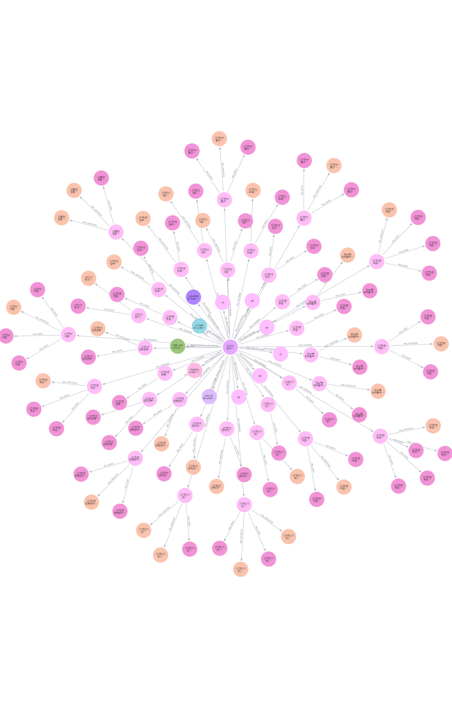
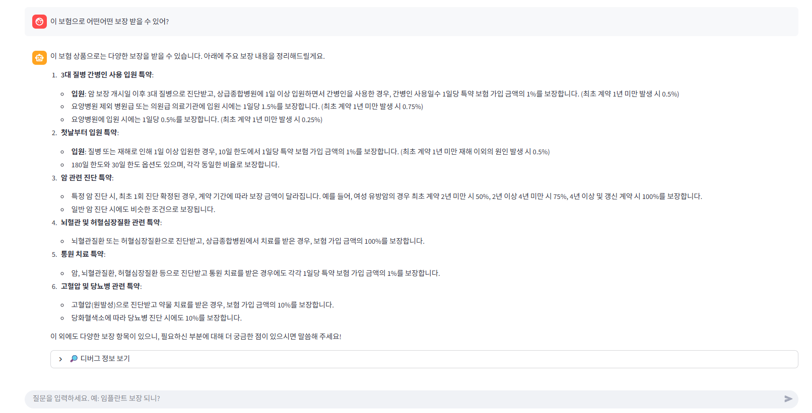
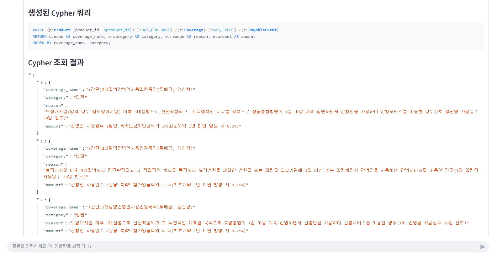
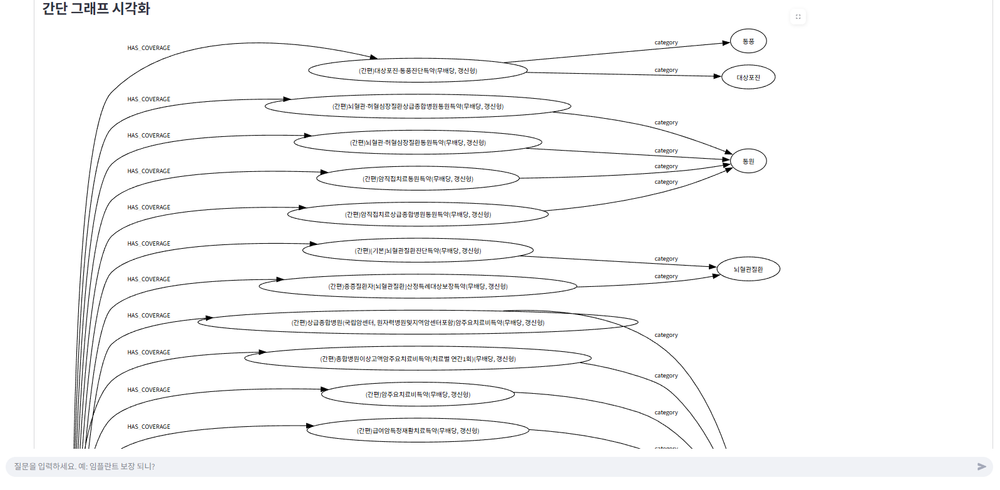

# 보험 상품 GraphRAG 데모 (Neo4j + Streamlit)

보험 **상품 요약서 / 사업방법서**에서 정보를 추출해  
**Neo4j 지식그래프 + LLM + Streamlit 챗봇 UI**로 Q&A 를 하는 데모 프로젝트입니다.

---

## 1. 전체 구조

### 개념 흐름

1. PDF → LLM → **JSON 구조화**
2. JSON → Python → **Neo4j 그래프 적재**
3. 사용자 질문 → LLM → **Cypher 생성**
4. Neo4j에서 그래프 조회 → LLM → **최종 답변 생성**
5. Streamlit UI에서:
   - 사용자 질문 / 답변
   - 사용된 **그래프 컨텍스트 요약**
   - 생성된 **Cypher 쿼리**
   - **쿼리 결과 (테이블 형식)**
   - (옵션) **그래프 시각화**

---

## 2. 지식그래프 예시

보험 상품 1개에 대한 **Product–Coverage–PayableEvent–Limitation–Qualification** 구조를 갖는 그래프입니다.



- `Product`  
- `Coverage` (주계약 / 특약)
- `PayableEvent` (지급 사유, 지급 금액)
- `Limitation` (면책 / 보상 제외 / 한도 등)
- `Qualification` (가입 조건)
- 기타 메타 정보 노드  
  - `RequiredSubscription`, `DividendInfo`, `PremiumInfo`, `PremiumDiscount`, `PrepaymentInfo`

---

## 3. Streamlit 챗봇 UI

### 기본 Q&A 화면

사용자가 자연어로 질문하면,  

- LLM이 **Cypher 쿼리를 자동 생성**
- Neo4j에서 결과를 가져온 뒤
- LLM이 최종 답변을 생성합니다.



---

### 디버그 정보 (Cypher / 그래프 컨텍스트 / 결과)

각 답변 아래에는 **“디버그 정보 보기”** 영역이 있습니다.

여기서 확인할 수 있는 것:

1. LLM에 넘긴 **그래프 컨텍스트 텍스트 요약**
2. 사용된 **Cypher 쿼리**
3. **쿼리 결과 행(row)들**
4. (옵션) **그래프 시각화**

#### Cypher 쿼리 / 컨텍스트 예시



#### 그래프 시각화 예시



---

## 4. 디렉토리 구조 예시

프로젝트 루트 (예: `C:\Users\JUNHA\graph-RAG`):

```text
graph-RAG/
├─ app.py                 # Streamlit 앱 (UI)
├─ llm_cypher.py          # 질문 → Cypher 생성 로직 (LLM 호출)
├─ llm_answer.py          # 그래프 결과 → 최종 답변 생성 로직 (LLM 호출)
├─ load_structured.py     # JSON → Neo4j 적재 스크립트
├─ data/
│  └─ shlife_product1.json # LLM으로 추출한 구조화 JSON
├─ images/
│  ├─ graph.png
│  ├─ QA_example.png
│  ├─ QA_cypher.png
│  └─ graph_v.png
└─ .venv/                 # (옵션) 가상환경
